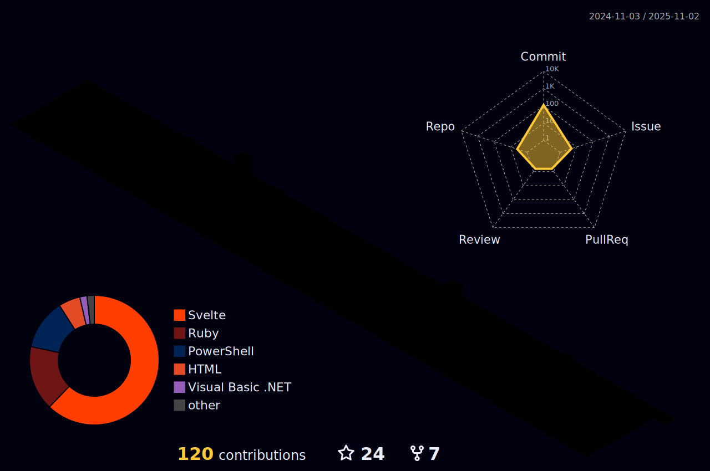

# Oh hi!

The name is Dale, and welcome to my github profile! I'm a web development enthusiast that decided to take on web development as a career for life.

Feel free to look around.

---

## Notable works

[![RGMTSI](https://img.shields.io/badge/laravel-rgmtsi-indigo?style=for-the-badge&logo=data%3Aimage%2Fwebp%3Bbase64%2CUklGRo4JAABXRUJQVlA4WAoAAAAwAAAATwAATwAASUNDUBgCAAAAAAIYAAAAAAIQAABtbnRyUkdCIFhZWiAAAAAAAAAAAAAAAABhY3NwAAAAAAAAAAAAAAAAAAAAAAAAAAAAAAAAAAAAAQAA9tYAAQAAAADTLQAAAAAAAAAAAAAAAAAAAAAAAAAAAAAAAAAAAAAAAAAAAAAAAAAAAAAAAAAAAAAAAAAAAAlkZXNjAAAA8AAAAHRyWFlaAAABZAAAABRnWFlaAAABeAAAABRiWFlaAAABjAAAABRyVFJDAAABoAAAAChnVFJDAAABoAAAAChiVFJDAAABoAAAACh3dHB0AAAByAAAABRjcHJ0AAAB3AAAADxtbHVjAAAAAAAAAAEAAAAMZW5VUwAAAFgAAAAcAHMAUgBHAEIAAAAAAAAAAAAAAAAAAAAAAAAAAAAAAAAAAAAAAAAAAAAAAAAAAAAAAAAAAAAAAAAAAAAAAAAAAAAAAAAAAAAAAAAAAAAAAAAAAAAAAAAAAFhZWiAAAAAAAABvogAAOPUAAAOQWFlaIAAAAAAAAGKZAAC3hQAAGNpYWVogAAAAAAAAJKAAAA%2BEAAC2z3BhcmEAAAAAAAQAAAACZmYAAPKnAAANWQAAE9AAAApbAAAAAAAAAABYWVogAAAAAAAA9tYAAQAAAADTLW1sdWMAAAAAAAAAAQAAAAxlblVTAAAAIAAAABwARwBvAG8AZwBsAGUAIABJAG4AYwAuACAAMgAwADEANkFMUEhHBAAAAaBFW9sZSXuSqq52j23btm3btm3%2BNsa2bdu2zTZL6bwX9X1vvp77WSsiJgDfBdR1PeX0NNmzp9a%2FBb8qY5efvPngzrn1MxuHKguoNn3nrTefv7y5s2tW%2FYAU0fL9Hk7cxD1V7Cqyzf9K7Oh%2F8miqtAob3WTVvNzObiXHoniy7FpbUk3A6HBS6fk%2FG0tv85iUfuxjV5DvIKl%2BUZ%2BRepmbFJvrMlrKfYPURzTRRCWOmqTcPJjWQu47lJIJLQUtYylF94Sygs8R03Vv3cJpcxdfjmbQ8wAg%2Fe8GMd3XF43p23fsX1cTGbRCZ2g%2FkzxhXf0A%2BNpL%2FvBR8rAhkPuESXLnvsb%2BENprr0%2BSGW0Y1Q2JeaQguBkWeIkoeXt6oMNHYj6tbANTK3lZQhGZJIFHSGz8EAK%2BrVM4OSc44P%2BDk5gbMgMo6JAA6TaYIlqoibp5RMZPOiw3fVEJyH2QmM6ROmAbFD%2BKAcdOU%2FS5kEA7SeKVflDoDzT4RMwnlQCk20AUlZ%2BBtFdENF%2BQO0EUngVKg2a5SG5szQ5ole4REe0JY6CmIbrr8OlD4pFQmvGoSfL4mXbA1j%2BefM3pHO2gyF3I56AoOkiF1vI1MZ9W1YD0W70kji%2FHQBUR9QYQ%2FE60Bwod46JIbh7LA6DUeWKe1BmOr6IlAHI6RWMVZNxNTGOSH6D1TiDmzczg7hNdA1DaFLWwpNV6RcwnLQBkXpJMctePYWD%2FLXoFoBoJzapWHAOTiHmmAIAiV4n5eagN%2FDmijxyqYiHHfoPkcbMdgGNwDDFPF4bV%2BaIPAEqboua86teI%2BamVHQhd4iS5d1VqWF4iegYgl0s0mqMPcBLzbBYARa4SM6GzDutnRKcBhH4Q7eRkiyK5c0YgYOsdSczzJaAwNFH0AwDtiCgykIFByZK3PTQg9WyD5MaaTFDZnsStAGCAiIZy9N0C80w%2BAHmumCSP7a9Dpf2%2BKC6bT75E0ddMDBR4QkTO38IAdHhHzFtVoLY3iU%2FpPtpZES21MdDKS%2FFtANh%2FNEhu7g4FQlQUeS8yR0DYwyvy%2FqAx9NUXcgLId4GY7p42BPzztqi1rI9IfD%2BdKOiEiLyzAmVIHQboLV4T82EVoOApoifVNQtl7pF0EKQ1DBGZBwpoEgAZFnpInrwxM%2FRmX4mIEsen5QSNiCLp3QCZ9oeEKHZZzUCBvfCsN8SMGudAwF9OEpov55YJ9HEUn3rfJGlsSTBDLsqIEu6v%2F3HqnEUXw4n7ur4OVPIQM%2BbBruVLd96MMknuHQ12vkcMpSfD4Ds1maHQnGXjIc%2BdFIgbFQChbUiSOuc8O6wWOaHsVSsNUr1fuKqE4X6wHjgxVomxKCvYBbeaKsxjxaC22navJfNqRzssBvS%2BZVp6NDAMyvMvimE5D1fXodBWbW88x320sQ0p6l9r4ppj1%2B7cPLv1hzZpoTy4ztj%2Ftx88tHP5xMZp8E3aAxw6vpsIAFZQOCAAAwAAUBAAnQEqUABQAD6dQJlIv7%2BiITM2aAPwE4lsDbrqQBIp5nzjHZEMtDnp%2F4q5K43%2FKf0I%2BqvxC%2BlJ5hv2Z9bj0Ef5v1AP8V%2FgOsA9ADyx%2F3J%2BCv%2B1f8n9zPbTfUiidVbbnu5Vbg5klyVS2Df5LQwXfZV4hq2Lbfimd66l0NimomtrjgLdRZvBMRxgYAD%2B%2FW5ILb%2BAK7OeIKzao2qMHXWKmjW%2FWXdwZwsmys%2FjX3P%2FJLkhMmH%2FHJtvGJ19f4vPp%2F7RDNQCZ4FcQJ%2Fybng5U9APvW%2Bs7c9q3F7BOIXf7z6%2Fk501%2FSUeteCSAv4viIyg85eHJr%2Fmeq%2BsjsJHyP4vgbgOtcgHba%2B317vkEGVKFyjInYHCmlXMDkh50LWPT%2FXr4Ok6Ze0z4oggH7Bn%2BDz2LRna%2BVQ8oqKtnarJJPL%2FTq%2BeEujqSHiTNXo445AWyojUzXRoDxme9f4p%2FtRTRxSLwgTb8ZLHZyQzMxd47wC9ayADOzIg0lnEBpO23L%2BrgGQ5DFTjeWChzdsiI8%2B%2FU%2F%2F%2BVn%2F%2FHM%2F%2F%2BQ0k%2B%2FN8Aq%2F9CEbhuLAzrsLRMkNa8b9M2nEbxHNAJwiY4njd%2BbImg6lQ%2B%2BoCjzQcfmjkXH9oERyWpdmcFEI9KbKJEuqLPjIrFizLzBrdjyorDhA55ac76mIr8aNGg%2F5%2FXn5GwJKXTpOw%2Bl%2Bgh3f8bPxtjujD6vsHRBG2ulhFnGEhPWrQeeLKbUY9NRVzqfkLk5bFpgp2AKOFe1KKjO1mleVbO17kVr%2BBz%2FKtPlVktTY2hqAfLSt%2BIsOr%2Bj6x%2BIRcOc1vqv3oEzPfNa%2Bqe0ugok4eH%2BGwT6MZLUYY0IOkUz2X%2FFapUuO1lWrcmv0xuk2qF8XCdh4Je53bornaFGtf9AsqEWwvAmxcIosbl%2FOYU7sNdL7%2BcR%2BFaMPdOVjICREIvw1xkwKyygdCA8%2FHRCVrqalarQQN81sKOdDfFTs0M3yrOuxepOfvnPzLkE86h%2BcyJ8BqVjZodqIMfHv%2F%2BbsCymfjABeCBefQmQQH6wAA&logoColor=white&color=%234f46e5)](https://rgmtsinc.com)

[![Aerial](https://img.shields.io/badge/sveltekit-aerial-indigo?style=for-the-badge&logo=data%3Aimage%2Fpng%3Bbase64%2CiVBORw0KGgoAAAANSUhEUgAAAGQAAABkCAMAAABHPGVmAAAANlBMVEVHcEzSkkfSkUfSkUfSkUfSkkjSkkjSlE3Sk0vSkUfSk0nSk0nSkkjSkUfSkkjSkkjSkkfRkUeDd6EyAAAAEXRSTlMAuPjK83xIDh3nLjuX11Znpv4qAPEAAANlSURBVGje7VlpE6sqDC37Iov%2B%2Fz%2F7BASDS69oeXPnjudLZ2xLSE5yEvDzefHixYsX%2FzKE6G9j0N1NSOa7R4ojI7q7oYjszQaa7NDdjUm5m2GWAeKCG3jC7MbeBs9GRAKQYU5%2FsSRmN6apmXTpDFF4WkEVYsPJKsMYftlKumaETnso5A8WEt6GLxtJ10ZNJ6BkZ0ZHNybaVIVhY3g6BUb8wI1G0kOagCWpstYqCp8pJoEbS1ibSF82Fg3YkblBzxmsuWcIhBAt4ReO5CcNpKdUjLDGVeUhtEclGWwMmTT5QQvpguESEn2kfzk4obZXN9oq3aXSI8Sc7GxdWPk1BdtIFwXnRZpDBFLh9%2FIu%2FLaIUA95d7WVPvIuUaUBbfIuNIcoajhUj7mrq7VN3jlSFCLTyevHtJac8QLpQu7LsKZTk%2BkLLpHOzfIrtpH2TGdNwBbXSGeYiYOMKTUszDcb1ypdkNQHtvulmU5Gv9i4SPqgUtf0mwaSSXfqmyMXK90H7sRHoEomVtLtZusK4mqlh4iz0HqM96ykEdHHpFOmIS7aiB64PO3nNc9Ix%2FeEUM7hUGsWppJYScf7mpDcJfDLqhh4t7KWPnxGegiiMHjBda84jbyDzkgL6YPd5tIwDMW5BnkPmYuqRm7OSA8jpCojZYu8Lxlczb%2B%2Fq3Rg5FhGGX5e6cCIudD8NhjF5wee7EivU7ntfLvn5GfyDqKyZFfqu2WDbBseBsFbj5KLCLPYVkvgNtEan408ejaidFb69aRU8a64BGiXLzmLFeXJo0rFYK%2BilhRY0%2B6VGOdFfDKWRP%2FzvRYtvxGvQPE4f44pN8UfEuzeOd1R2H4p2Ke2Tyu9aihh6WVJqN8HRX9zeo%2BksKUPh0SClbodVG5fzoQ4hT9ztVOlLfn3p%2FcQpzB5iUT95E%2FV5e7lTJ5XQlYtrlQBg5V%2Fk%2FRVWcIRYwkOJvpY8R8d2WKcokjag%2B5dyH94ZAvDBPZgQbheJv%2FpkS26YjXIJtiUEvlPSF9ZiblbsgnuOwx8j0gHQ0McG%2FOhykLy57Qbf3BOjx7EiCQrqpZa%2F5tzeqyHGKNghbKTY%2BVDxMQiQ7qG63VHnW6HohXpu91RJ%2Bki%2FNMVMlqxTvwPVlTvu%2FZwkdX9xYRgCvV%2BMRGUvf%2BbohcvXrx48eIvw3%2F1l2oXkrq0oAAAAABJRU5ErkJggg%3D%3D&logoColor=white&color=%234f46e5)
](https://github.com/lnfel/aerial)

[![Static Badge](https://img.shields.io/badge/sveltekit-lamy--debugbar-indigo?style=for-the-badge&logo=data%3Aimage%2Fpng%3Bbase64%2CiVBORw0KGgoAAAANSUhEUgAAACAAAAAgCAYAAABzenr0AAAABGdBTUEAALGPC%2FxhBQAAACBjSFJNAAB6JgAAgIQAAPoAAACA6AAAdTAAAOpgAAA6mAAAF3CculE8AAAABmJLR0QA%2FwD%2FAP%2BgvaeTAAAACXBIWXMAAAsTAAALEwEAmpwYAAAAB3RJTUUH5gcfEQIyUZYzowAACNBJREFUWMOllmtwVdUVx%2F97n9c9952bmwe5NzEhvKGpQWzrewIqhVYpiBXro5Y6zijMaB0dx2JxarVDFUUshUF8YGGmUuj0g4PWEZUqxqAC8pJHCJDkhoTkvu859zz32f1gdYbGYLDr4zlrr%2F9v%2FmvtNZtghLjrhnkIR2OQAkGVi4JpMpuvXbcWFxovb3oXVBSU%2FqHMFd3dqV26ptmb1y%2F7%2Br840sGyX8LGTa9i61s7FgUCwaNzrvrhx9OmfQ%2F3Lbl31OLLn9yAebfOxNFD3dfWNlT%2FbN%2FBzz%2BMRCLn5NCRDgv%2FZYvEaq6JxKu3%2FGtnx2Kz7Kivbnx9VOIPPLwMv192N3bv%2FOTqYFB9viIarOze87EX850rOSIANy0AIHpJEwQi1lfG4msmtXx%2FrSqrzYc7TTy09PYRxVc%2F90cobkZ%2B%2F9%2Fv3NbUWLExEiLjuMTzn%2BzdwQrl7OgAiOuBc871fMlkzIPi96lV1bV3RWtqth448E7byjWbseyxJ77OL3X2gXOOj%2Fa9h%2BTEpvgtixevmDh50vqqqjFNxBeB6WGQc46sPkoHHLOMLADdMNPM4wAIouEAKiqirfFY9Wtbt76x4Kknl%2BOZlasAAMteWIFj3cfALHH8JdMv2zh%2BwtT745XJgCCrIITAKZunThZtzLn%2BznN0RhxCwfLwWfsBSMTrJtz7MpkSVIf9qImQeq8h8uf9ez41W6bPeLPLS9Aj%2FXkxezbT0DR23IZoJHaNIsjwOEAFAtFyNGilI32dnVh807TRAWzZ9S5uGkhB4E4nBTMAqOAeImEBwXASoFJdNlRc%2BcnuvSf38wavpil5m78u8gNFVa8RiAgQDnBAJABx7FPFzOBRLTfc8BFbAACnurqQSvUdNzW9z0dd%2BGQG2R8CEf0gVIKkBiaXPSyxaGAxC8Z%2B68q%2B6zghoJQCnIAQAoEDmlZqXzh%2F7tCxrq4LAzh%2B7AiWPfrAmXIh366gCIG4MEwPHjg4OJjHcaaEeVIgfBcLxcWipgjEE0AAfDk3QNkwtP6zg%2F88cKST79q7d5iGeD6AD97ahLd2fcTyg%2BktuXL0JkmRA4ZugMgSwgE%2FbIdBD1UmqxriZFoTgU%2F1QIkExjww5oLARjrd83Z7R8eHNfEYtm9%2BefisnQ8gW7Ix4%2BJW9Had6K1qqG%2Fksr%2BVuQRlw4EoSshqDg45hKjVAYxLeKhxbEQlEbahwTNyyOWGTvac6rp%2FxrSmnnuWPoJ8ZujCHACAl9odHH79aWt%2B8LJdLVMK82UpEA2KMqK9p1DO5fCFmETtJA7OPLhlDxlLg8pM2IbZM5Au%2F6Zt1o17Hl2%2BAaePHf7G%2Bt8K8NPGMu789Vypw3aqtnf6%2FVJ1Aorfh4aYgbwmoD9vIi8Y6Nt3BgG%2FjlBjtakVCzty6fRT19%2FQ1rHyiWex4g8PjVh%2FxBZMaG7Gmhf%2FCgovEZt6%2BYqWWuXuMHWDpy0%2FCcWDoIKAVAaAloeR0aD1dCNUKaNf188MaOZHwVCYnezqkkTu5Jfcc6%2FTOTiA1MmTowOY3tqC5%2F%2F0NLKDqXHNE8a92NCQuKWiotpfE5ZJmOsoWyaKZQf5rI754yXU%2BzkO8xpEpk2AUD8mYkXiPyoaZF59KPjzsVUV07Vi6eCNs2YPGWULB784eH6AhdfOwZKHH8HAUGZ8c3NiQ21NaFZQjUBVVTBKUeWniJYGkevuwVmTwmACTmUsVF4Ux5SJKiQR6C8I%2BPS0TTJDBd%2BlddLkoF9OplLdb17SerG1ecvfRgb45W2LMP%2BexciVss3xZGJ9ZSTYFlYJXIQBTmE7DDYoPMWPw0oSWjCBgqCCpnvRGiugNhGCXrBgDuiYVUOxsDWOuqoAFAVjuYRjzc31B1yuYPfuj4cP4WMPPojWRQtQTPVPitYl1kpyoM3iFK5LwCkAgcOvKigYFj4vUgQbKnGpAsQiCpz9CiYyhiYigUQ4EokAakI%2BCJSAexyu4pc9g9z6zCt%2F%2F0dV8yRj2C14de1GdNz3O7DZc66M1iZWgUgzXJOgaHMwJkKSXfh9FNxzeE%2F3ANmXb4Aoybio1gYt5VHHGSZNHouYX0B10AdFoOCcw%2FM4mOtB9wRI4XjLlTNnJgghJ84B2N7egXKpVLXgszfu9gR5qek4deV0CZLpcsZcR6Ok7NBCJhDyd7Jyyc4bypwC80nSYAGObqAhWkZ1JMSpQOF4hAwVdMQCPqiKCO4BDufgnECWpHgwEhqrquq5AIwxMI%2BpzHbLmq69lB5Km3ZeL4XA8tR10g7HYMl2B3s6D%2Bcunz1nNfdVSuO4gflTKGYkI%2FCcACzb6CvqRQiMJKmggBAAHKAEECiByACJEp8iiY3xePzcRXTjVVcAQA%2BA1SPthFWr1uGiiRMbiajObIzJuH5sFFNqQ2Cco2xa8NlsqHD6yI5wYMyD4doWQRAluMyD63qghMAvcFgWg0BJckLcjzWbtmHpHQtHtwkBIBiJwbWtRonSmrDoQqAMlgdIlECVJTDbFXt7Cxt8oSi15fytBKgol23KbNcuGY5pc9iV8VhU4kK1AMDR2PBbcL5QFBme50YUwmXJMuAZeWhuGBUyBUCgadrQ2x%2BeSO07UXx06tTcep8sJwkjome7pb6sXjremzZv%2BMnVY6gkBVeseo3GYhHvggAESYbIXCZQykXGQY0CNNOAX%2FDDNm30D%2BZ2r1v3uNE282Y88fi2TgCd%2F1vj0uve7uIWR%2FLiWhBCLswBIniQZCFLRWIRAgmOBVbK4ozuIJfJ9x49fnbbwKCOne9vG7HG7W2zv%2FH7eV9EX4UHG0Tmg6Iq5rkswmZAIadhYCCjpXoHnvzVL2bu3fle%2B2hKDYtROaBrGjxKBpEQUx5VknlbgGdzyzS1FR%2B8s%2FOV1X95HfcvWfSdAEblQPZMCvfecWdRt%2BxDjijCI5KjlbTnD33%2B2XNTp09wv6s48C1Psq8i%2FcURrN3%2BLrRiMRkMRH7MLHtddmhgeW1dXfmOm%2Bd%2BZ3FglC3Y398PwbGgCMIep6w%2FmxvKPxMIRfUFc6%2F6v8QB4D%2FoUwuE%2BYMFaAAAACV0RVh0ZGF0ZTpjcmVhdGUAMjAyMi0wNy0zMVQxNzowMjo1MCswMDowMDlp11sAAAAldEVYdGRhdGU6bW9kaWZ5ADIwMjItMDctMzFUMTc6MDI6NTArMDA6MDBING%2FnAAAAV3pUWHRSYXcgcHJvZmlsZSB0eXBlIGlwdGMAAHic4%2FIMCHFWKCjKT8vMSeVSAAMjCy5jCxMjE0uTFAMTIESANMNkAyOzVCDL2NTIxMzEHMQHy4BIoEouAOoXEXTyQjWVAAAAAElFTkSuQmCC&logoColor=white&color=%234f46e5)
](https://lnfel.github.io/lamy-debugbar/)

---

## Tech stack

Throughout the years in my endeavor as a professional web developer I learned many things and gained experience with each encounter. I might forget some of those encounters but I'm listing it here for my future self.

### I speak with these languages

### Got hands on the job experience with these frameworks

    
More web development skills

### Made cool looking websites using these badass css frameworks

### Frequently uses the following database tooling

### I may be undergrad but I have a degree with these javascript runtimes

### Heard about one man development team? I can also be the DevOps department

### Has professional expertise with well known cloud providers

### Other software and tooling I am familiar with

### Currently learning

---

## Contributions Stats

